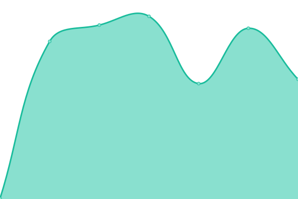
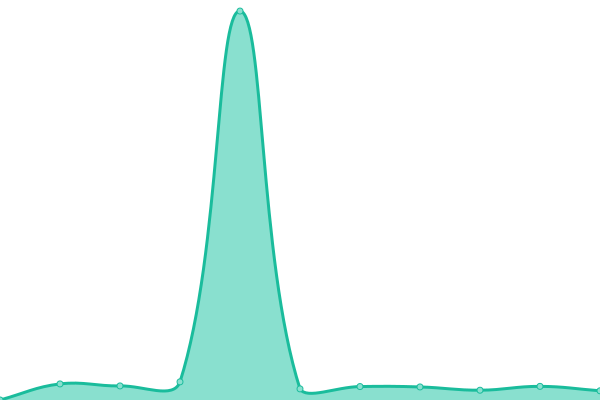
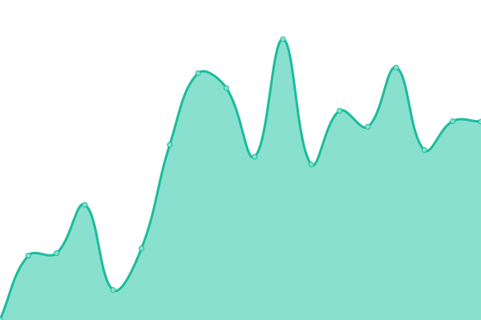
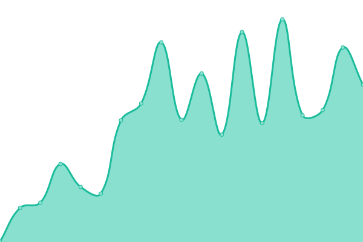
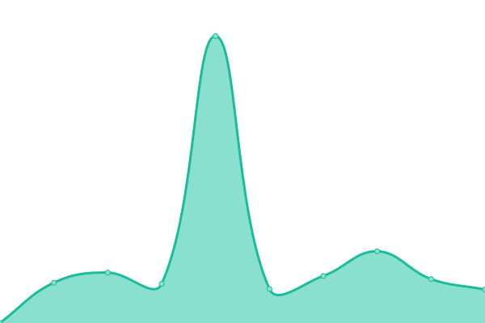

# [📈 Live Status](https://status.jonakats.com): <!--live status--> **🟩 All systems operational**

This repository contains the open-source uptime monitor and status page for [kats1123](https://status.jonakats.com), powered by [Upptime](https://github.com/upptime/upptime).

With [Upptime](https://upptime.js.org), you can get your own unlimited and free uptime monitor and status page, powered entirely by a GitHub repository. We use [Issues](https://github.com/kats1123/Status/issues) as incident reports, [Actions](https://github.com/kats1123/Status/actions) as uptime monitors, and [Pages](https://status.jonakats.com) for the status page.

<!--start: status pages-->
<!-- This summary is generated by Upptime (https://github.com/upptime/upptime) -->
<!-- Do not edit this manually, your changes will be overwritten -->
<!-- prettier-ignore -->
| URL | Status | History | Response Time | Uptime |
| --- | ------ | ------- | ------------- | ------ |
|  Home Network | 🟩 Up | [home-network-check.yml](https://github.com/kats1123/Status/commits/HEAD/history/home-network-check.yml) | 

 313ms
     
 | 

<a href="https://status.jonakats.com/history/home-network-check">99.95%</a>
    

|  [Server](https://server.jonakats.com) | 🟩 Up | [server.yml](https://github.com/kats1123/Status/commits/HEAD/history/server.yml) | 

 541ms
     
 | 

<a href="https://status.jonakats.com/history/server">100.00%</a>
    

|  [AIO Metadata - Does Search Work?](https://aiometadata.jonakats.com) | 🟩 Up | [aio-metadata.yml](https://github.com/kats1123/Status/commits/HEAD/history/aio-metadata.yml) | 

 685ms
     
 | 

<a href="https://status.jonakats.com/history/aio-metadata">71.69%</a>
    

|  [AIO Streams - Do Streams have Links?](https://aiostreams.jonakats.com) | 🟩 Up | [aio-streams.yml](https://github.com/kats1123/Status/commits/HEAD/history/aio-streams.yml) | 

 463ms
     
 | 

<a href="https://status.jonakats.com/history/aio-streams">71.72%</a>
    

|  [Comet](https://comet.jonakats.com) | 🟩 Up | [comet.yml](https://github.com/kats1123/Status/commits/HEAD/history/comet.yml) | 

 543ms
     
 | 

<a href="https://status.jonakats.com/history/comet">71.76%</a>
    

|  [StremThru Torz/Proxy](https://stremthru.jonakats.com) | 🟩 Up | [strem-thru-torz-proxy.yml](https://github.com/kats1123/Status/commits/HEAD/history/strem-thru-torz-proxy.yml) | 

 352ms
     
 | 

<a href="https://status.jonakats.com/history/strem-thru-torz-proxy">100.00%</a>
    

<!--end: status pages-->

[**Visit our status website →**](https://status.jonakats.com)

## 📄 License

- Powered by: [Upptime](https://github.com/upptime/upptime)
- Code: [MIT](./LICENSE) © [Anand Chowdhary](https://anandchowdhary.com), supported by [Pabio](https://pabio.com)
- Data in the `./history` directory: [Open Database License](https://opendatacommons.org/licenses/odbl/1-0/)
